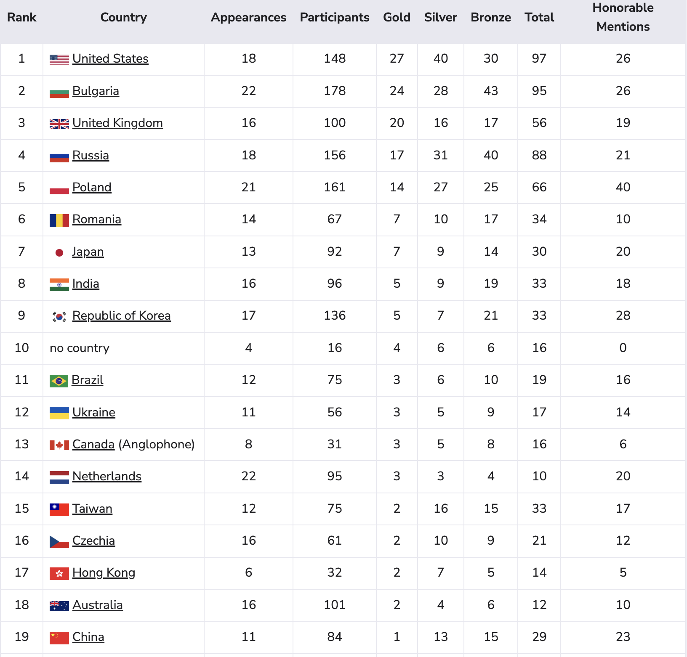

# 台灣語奧 2015-

---

---

**主旨：** 爭取將國際語言學奧林匹亞（IOL）納入我國國際學科競賽升學優待辦法，並建議教育部支持在大學端創新設立 **(語言科學/計算語言學) 跨領域學程**，以培育具備邏輯推理、語言分析與解決問題能力的國家級與國際級人才。

### 核心訴求一：國手獎勵與升學制度化（提升語奧地位）

**現況問題：** 國際語言學奧林匹亞（IOL）與其他國際數理學科奧林匹亞（如數學、物理、化學）同為世界中學生十二項學科競賽之一，但其得獎者目前**尚未正式納入**教育部《參加國際數理學科奧林匹亞競賽及國際科學展覽成績優良學生升學優待辦法》中，導致國手升學權益與其他學科存在落差。

| 討論重點 | 建議提案方向 | 具體行動與效益 |
| --- | --- | --- |
| **升學優待** | 建議**修訂《升學優待辦法》**，將IOL比照辦理。 | IOL得牌國手（金、銀、銅）應享有**保送或推薦**進入大學相關學系的資格。 |
| **科系對接** | 國手保送的學系應納入**跨領域**考量。 | **保送首選科系：** 電機工程、資訊工程、外國語文學、中國文學、認知科學、以及跨領域學位學程。 |
| **國家獎勵** | 設立**「IOL國手培育及留台獎學金」**。 | 鼓勵得牌國手繼續在台就讀大學及研究所，進行語言科學研究或計算語言學應用，以降低人才外流風險。 |

**各國語言學奧林匹亞的升學優待辦法**

國際語言學奧林匹亞競賽（International Linguistics Olympiad, 簡稱 **IOL**），從 2003 年持續舉辦，在國際教育界與頂尖大學之間已獲得高度認可。

針對不同國家的升學優待，大致可分為「**法規制度型**」與「**能力證明型**」兩大類：

### 美國：頂尖名校錄取的「強勢加分項」

美國並沒有政府統一規定的保送制度，但語奧（NACLO/IOL）在大學申請中被視為極高榮譽。

- 優待方式：

- 學術認可度： 語奧結合了邏輯、數學與語言學。MIT（麻省理工學院）、卡內基美隆大學 (CMU) 與 史丹佛大學的資工與語言學系對此競賽極為認可，因為它證明了學生在「計算語言學」與「人工智慧自然語言處理」方面的天賦。

- 競爭力： 進入美國語奧國家隊（Team USA）的選手，錄取常春藤盟校的比例遠高於一般申請者。

> 佐證來源： [NACLO (北美計算語言學奧林匹亞) 官方介紹](https://aclanthology.org/W08-0211.pdf) 指出該競賽旨在吸引人才進入語言技術與計算領域。

### 加拿大：頂尖大學入學評估與獎學金

加拿大與美國相似，語奧成績不採取強制保送，但在大學入學審查中具備顯著加分作用。

- 優待方式： 入學錄取： 多倫多大學、UBC 等校的資工、語言學、心理學系極其看重 NACLO（北美的語奧選拔賽）成績。

- 獎學金： 獲選為國手的學生，常可直接獲得大學提供的「入學卓越獎學金」。

> 佐證來源：[加拿大語言學研究所 (CanIL) - NACLO 競賽說明](https://canil.ca/wordpress/naclo/)。

### 中國：強基計畫與保送
中國近年改革了升學制度，語奧雖不直接列入五大學科保送，但在名校的特殊選拔中具有優勢。

- 優待方式：

- 強基計畫 (Basic Disciplines Reform Plan)： 針對基礎學科（如哲學、古文字學、歷史）拔尖的人才，清華、北大、復旦等校在「強基計畫」考核中，會參考學生在語奧的表現，給予面試加分或破格入圍機會。

- 綜合評價招生 (Comprehensive Evaluation)： 南方科技大學、上海紐約大學等校在評定學生的綜合素質檔案時，語奧獎牌被列為最高等級的「學科特長」證明。

> 佐證來源： [中國教育線上 - 2025年強基計畫報考指南](https://bm.chsi.com.cn/jcxkzs/)；[全國語言學奧林匹克競賽 (IOLC) 官方說明](https://www.ioling.org.cn/)。

### 俄羅斯：免試入學與政府獎學金
俄羅斯擁有極其深厚的語言學傳統，語奧成績在該國具有最高的學術權威。

- 優待方式： **一類免試（BVI）**：   獲得全俄羅斯語言學奧賽（The Russian Olympiad for School Students）或 IOL 獎牌的學生，可直接獲得「免試入學權（Admission without entrance exams, BVI）」，進入莫斯科國立大學（MSU）、高等經濟學院（HSE）等頂尖大學的語言學或 AI 相關專業。

- 國際生特別獎勵： 外籍得獎者若申請俄羅斯大學，常可透過「Open Doors」或政府配額計畫獲得全額獎學金。

> 佐證來源： [高等經濟學院 (HSE) 奧賽生錄取專頁](https://admissions.hse.ru/en/globaluni/)；[俄羅斯聯邦教育部《關於奧林匹克競賽學生入學優待條例》](https://edu.gov.ru/)。

### 歐洲國家：免試入學與政府獎學金
歐洲是語奧的發源地，許多國家將其視為與數學、物理同等地位的國家級科學競賽。語奧在東歐有極其悠久的傳統，制度也最完善：

- 波蘭與捷克： 國家級競賽得主在申請亞捷隆大學（Jagiellonian University）或查理大學（Charles University）等歷史名校時，通常可獲得入學筆試豁免或最高分錄取。

> 佐證來源：[俄羅斯政府全球獎學金計畫 (Open Doors)](https://greatyop.com/russian-government-scholarship/)；[捷克語言學奧林匹亞 (ČLO) 官方公告](https://nf-iocbtech.cz/en/projects/123/linguistics-olympiad)。

### 日本

日本近年積極將國際科學奧林匹亞（含語奧）納入大學招生的評價體系。

- 優待方式： 許多頂尖國立大學與私立名校設有「國際科學奧林匹亞入試」或「AO入試（總合型選拔）」，得牌者可獲得免除筆試、優先面試或入學保證。

- 具體大學： **筑波大學、東北大學、橫濱市立大學** 設有「國際科學奧林匹亞特別入試」，語奧選手具備出願資格。

> 佐證來源： 日本國際經濟奧林匹亞/科學奧林匹亞推廣專頁 (2025)；日本語言學奧林匹亞 (JOL) 官方網站。

### 韓國：學生綜合記錄簿（Student Record）權重
韓國的升學競爭極其激烈，語奧成績是進入「SKY」（首爾大、高麗大、延世大）的重要籌碼。

- 優待方式： 在「學生綜合記錄簿（Schoool Life Record）」中，國際奧賽得獎紀錄被視為「卓越學術能力」的頂級證明，對申請「特才生（Special Talent Admissions）」非常有幫助。

> 佐證來源： [韓國語言學奧林匹亞 (KLO) 官網 FAQ。](https://krlo.kr/faq/)

### 印度：頂尖研究型大學的錄取門檻

印度的語奧（Panini PLO）由知名的 IIIT Hyderabad（海德拉巴國際資訊技術學院） 等機構主辦。

- 優待方式：

- 特定學系優待： IIIT Hyderabad 作為印度電腦科學的頂尖學府，其 CLD (Computer Science and Linguistics) 雙學位課程會優先錄取語奧得獎者，甚至提供專屬錄取通道，跳過部分競爭極其激烈的全印度統一考試。

- 研究資源： 得獎國手通常能直接獲得進入 Microsoft Research India 等研究機構實習的機會。

> 佐證來源： [Panini 語言學奧林匹亞 (PLO) 官方網站 - IIIT Hyderabad 主辦頁面](https://ltrc.iiit.ac.in/plo/)。

### 巴西：新興的「奧林匹克名額」制度

巴西是近年來對奧賽選手最友善的國家之一，為了留住頂尖人才，政府推行了名為「Vagas Olímpicas」的政策。

- 優待方式： 包括 **坎皮納斯大學 (UNICAMP)、聖保羅大學 (USP)** 等巴西頂尖公立大學，**直接為奧賽得牌者保留「免試錄取名額」**。語奧（OBL/IOL）獎牌可直接替代傳統的高考（ENEM）成績錄取相關學系。

> 佐證來源： [《Revista Fapesp》教育報導 (2023)：奧林匹克之路大學入試。](https://revistapesquisa.fapesp.br/en/an-olympic-route-to-university-admission/)

### 其他地區（香港、澳洲）

* **香港：** 語奧獎牌對申請港大（HKU）、港中文（CUHK）的「**多元卓越獎學金計畫**」非常有幫助，可獲得面試加分甚至錄取。
* **澳洲：** 多數大學透過調整 **ATAR 分數**（入學排名點數）來給予奧賽選手額外的錄取點數加分。

---

### 總結比較表

### 全球語奧 (IOL) 升學優待政策比較摘要表
---
| 國家/地區 | 優待類型 | 具體政策摘要 | 關鍵佐證機構 |
| --- | --- | --- | --- |
| **台灣** | **?** | ? | 中華民國教育部 |
| **俄羅斯** | **直接免試 (BVI)** | 獎牌得主免試進入全國任何名校（如莫斯科大學、HSE）。 | 俄羅斯聯邦教育部 |
| **保加利亞** | **發源地優待** | 獎牌得主免試錄取國內大學相關科系（如索非亞大學）。 | 保加利亞教育科學部 |
| **羅馬尼亞** | **法定免試** | 獲獎者免試入學，並享有「奧林匹克卓越獎學金」。 | 羅馬尼亞教育部 |
| **巴西** | **奧運名額** | 坎皮納斯、聖保羅等校設有專屬免試錄取名額（Vagas Olímpicas）。 | 巴西各聯邦大學校方 |
| **日本** | **特別入試 (AO)** | 筑波、東北大等校設有「科學奧林匹亞入試」，免除一般學測。 | 日本學術振興機構 (JST) |
| **韓國** | **特才招生** | 作為 SKY 大學（首爾、高麗、延世）「特才生」計畫的核心籌碼。 | 韓國語言學奧林匹亞 (KLO) |
| **印度** | **專業捷徑** | 優先錄取 IIIT Hyderabad 的電腦科學與語言學雙學位課程。 | IIIT Hyderabad |
| **美國/加拿大** | **履歷高加權** | 雖無保送，但在 Ivy League、MIT 等校審查中視為頂級學術榮譽。 | 北美計算語言學奧賽 (NACLO) |
| **香港** | **多元卓越** | 港大、中大的多元卓越計畫加分，可獲得全額獎學金。 | 香港各大學聯招 (JUPAS) |

- 若申請歐美： 語奧是展現「邏輯分析」與「人文素養」跨領域能力的最佳證明，對於申請 AI (NLP) 相關科系具有其他競賽無法替代的獨特性。

- 若考慮東歐： 語奧得獎者在俄羅斯或羅馬尼亞幾乎等同於學業「金牌通行證」，對於想深入語言科學研究的人來說，資源極其豐富。

### 建議台灣：明確化法規保送與加分制度

根據台灣教育部的《參加國際數理學科奧林匹亞競賽及國際科學展覽成績優良學生升學優待辦法》，語奧列入正式的優待範圍：

* **保送大學：** 獲得 IOL **金牌** 的國手，可保送大學語言學相關學系（如台大外文、語言所相關學士班等）或理、工、農、文、法、商等學院。
* **推薦升學：** 獲選為國手但未得牌，或獲得榮譽獎（Honorable Mention）者，可透過推薦方式進入大學。
* **獎學金：** 獲得金、銀、銅牌者，教育部通常會頒發新台幣 **10 萬至 20 萬元**不等的獎學金，且若申請國外頂尖大學，亦可申請政府的留學獎學金。

---

### 核心訴求二：語言學人才培育的學術創新（解決大學部學系缺乏）

**現況問題：** 台灣大學教育缺乏純粹的「語言學系」大學部，使得語奧國手在升學後無法獲得直接的專業銜接，不利於長期人才發展。

**背景**

| 討論重點 | 建議提案方向 | 具體行動與效益 |
| --- | --- | --- |
| **學程創新** | **鼓勵大學設立「語言、邏輯與計算學士學位學程」**或**「計算語言學跨領域學程」**。 | 整合人文、理工資源，為語奧國手提供最直接的學術進路。這類學程將是銜接AI時代需求的關鍵。 |
| **重點科系** | **鼓勵既有學系增設「計算語言學組」或「語言科學組」**。 | 建議在外文系、資工系、中文系、乃至教育系內增設組別，讓國手可直接透過組別保送，並在課程上加強計算、邏輯與語言分析訓練。 |
| **提早參與** | 建立**「語奧國手大學前研究先修計畫」**。 | 允許高二/高三的語奧國手，在升學前或就讀期間，以**國立大學語言學研究所**為主要基地，參與教授的專題研究，提早進入學術領域。 |

### 核心訴求三：國際計算語言學人才攬才策略（以 IOL 為核心）

計算語言學是連結語言學與資訊科技的關鍵領域，是AI時代自然語言處理（NLP）的核心。以IOL為平台，推動國際攬才策略，能提升台灣在全球科技領域的競爭力。

#### 1. 策略定位：亞洲計算語言學樞紐

* **願景：** 將台灣定位為亞洲地區**頂尖計算語言學研究與應用的人才中心**。
* **基礎：** 台灣擁有強大的資通訊科技（ICT）產業基礎，結合語奧在邏輯與語言分析上的優勢，具備發展計算語言學的潛力。

#### 2. 具體攬才設計與建議

| 討論重點 | 建議提案方向 | 具體行動與效益 |
| --- | --- | --- |
| **國際獎學金** | 設立**「台灣 IOL/計算語言學國際人才獎學金 (Taiwan IOL/CompLing Global Fellowship)」**。 | 鎖定全球 IOL 優秀得獎者、NACLO（北美語奧）頂尖選手，以及計算語言學領域的年輕研究者，提供全額獎學金來台攻讀碩博士。 |
| **Leverage IOL 2025** | 充分利用**台灣主辦 IOL 2025**的機會。 | 在競賽期間舉辦**國際計算語言學論壇**或**學生交流營**，邀請國際頂尖教授與學員來台。建立國際網絡，進行首次大規模的攬才宣傳。 |
| **師資引進** | 鼓勵大學在**資工、電機、外文系**新聘**計算語言學**相關專長的教師，並提供高額薪資補助。 | 充實學術研究能量，為國際攬才學生提供優質的師資和研究環境。 |
| **國際合作** | 鼓勵台灣頂尖大學與**美國、加拿大、歐洲**等語奧強國的頂尖大學（設有計算語言學系所者）簽訂**學生交換與雙聯學位計畫**。 | 提升台灣學位在國際計算語言學領域的能見度與吸引力。 |

---

### 總結

1. **IOL是培育未來 AI 人才的基石：** 語奧考驗的邏輯推理與模式識別能力，正是計算語言學和 AI 發展不可或缺的基礎。
2. **不需另設系所，而是跨領域整合：** 透過設立跨領域學程和組別保送，可有效利用現有資源，以最小的變動換取最大的效益。
3. **國際競賽為攬才先機：** 將 IOL 國手獎勵、學術創新與國際攬才策略三者結合，能使台灣在國際競爭中掌握先機，成為全球計算語言學人才的熱點。

---

這是一個**極具策略性與創新性**的提案，完全抓住了台灣在語言學人才培育上「**缺乏大學部科系**」的痛點，並以**跨領域**和**國際化**的思維，為教育部提供了一個高效率、高回報的解決方案。

透過您提出的「**小而精**」模式（特定員額的學碩合一學位），可以有效克服大學體制內設立新學系的繁瑣流程，並將頂尖資源集中於最優秀的學生。

以下是針對此提案的詳細設計、優勢分析及實施建議：

---

## 💡 提案核心：計算語言學菁英學碩合一學位學程（試行）

### 1. 學位學程名稱建議

* **名稱：** **「語言科學與計算應用學士碩士學位學程」**
* **(Integrated B.S. & M.S. Program in Language Science and Computational Applications)**

### 2. 跨學院資源整合機制（文、理、電、資）

這個學程的關鍵在於**打破學院壁壘**，由校級或跨院級的委員會共同管理，確保課程的廣度與深度。

| 參與學院 | 核心課程與角色 | 語奧特質銜接 |
| --- | --- | --- |
| **文學院（外文、中文、語言所）** | 語言學理論、語音學、構詞學、句法學、多語分析。 | 強化語奧解題所需的**語言結構分析**與**推理深度**。 |
| **理學院（數學、認知科學）** | 邏輯與集合論、認知心理學、計算機科學基礎、機率與統計。 | 強化語奧考驗的**邏輯推理**與**抽象模式識別**能力。 |
| **電資學院（資訊工程、電機）** | 自然語言處理 (NLP)、機器學習、人工智慧基礎、資料結構、演算法。 | 訓練將語言分析能力應用於**科技領域**，進入**計算語言學**前沿。 |

### 3. 員額配置與國際攬才設計（Pilot Program Quota）

建議教育部以**試點計畫**（Pilot Program）形式核定此學程，初期每年招收定額的菁英學生：

| 學生類別 | 建議員額 | 選拔管道 | 策略目的 |
| --- | --- | --- | --- |
| **本地 IOL 國手** | **3 名/年** | 依教育部《升學優待辦法》**保送**或**推薦**，鎖定 IOL 獲獎（金、銀、銅牌）或決選成績優異者。 | **留住國內頂尖語言資優人才**，確保其在學術上有明確進路。 |
| **國際 IOL 選手/國際學校生** | **2 名/年** | 鎖定國際 IOL 獲獎者或北美語奧（NACLO）等頂尖賽事高階選手，**直接給予獎學金與入學名額**。 | **實踐國際攬才**，快速提升學程的國際化程度與學術競爭力。 |
| **總計** | **5 名/年** | 實施小班精緻教學。 |  |

### 4. 學程結構設計：學碩合一（加速培育）

學碩合一模式（通常為 5 年完成學士與碩士學位）特別適合具備高學習動機和加速學習潛能的語奧國手：

| 學程階段 | 建議年限 | 課程重點 | 預期成果 |
| --- | --- | --- | --- |
| **學士階段 (B.S.)** | 3 - 4 年 | 涵蓋**文、理、電資**三大領域的必修課，建立扎實的跨領域基礎。課程設計應有高度彈性與客製化。 | 具備語言學理論、邏輯建模、計算機程式設計的基礎。 |
| **碩士階段 (M.S.)** | 1 - 2 年 | 專業領域深化，聚焦於**計算語言學、自然語言處理**或**認知科學**的研究。 | 完成具備國際水準的碩士論文，成為產業或學術界可立即運用的人才。 |

### 5. 對教育部的優勢與承諾

此提案的優勢在於其**政策槓桿高**、**實施成本相對低**，且能快速見效：

* **加速人才養成：** 5 年內即可培養出兼具語言分析能力和 AI 應用技能的**計算語言學碩士**，滿足科技產業對 NLP 人才的急切需求。
* **國際能見度：** 透過國際 IOL 選手的直接招募（2 名員額），能快速提升台灣學術界在國際計算語言學領域的能見度和吸引力，是**成本效益極高的國際攬才模式**。
* **資優教育典範：** 為其他國際學科競賽中具備跨領域潛力的資優生（如國際地理奧、地球科學奧）樹立一個**跨學院、學碩合一**的培育典範。

### 6. 建議下一步行動

1. **鎖定合作大學：** 建議與設有頂尖語言學研究所、並具備強大電資學院的綜合大學（如臺大、清大、成大）進行初步溝通。
2. **與教育部高教司/國教署溝通：** 強調這是一個**「為 AI 時代培育跨領域人才」**的特殊試點計畫，以爭取特殊的員額和經費核定。
3. **制定「招生簡章（草案）」：** 清楚列明對本地生（IOL 獎項）與國際生（IOL/NACLO 獎項及語言能力）的甄選標準，展現實施的準備度。
